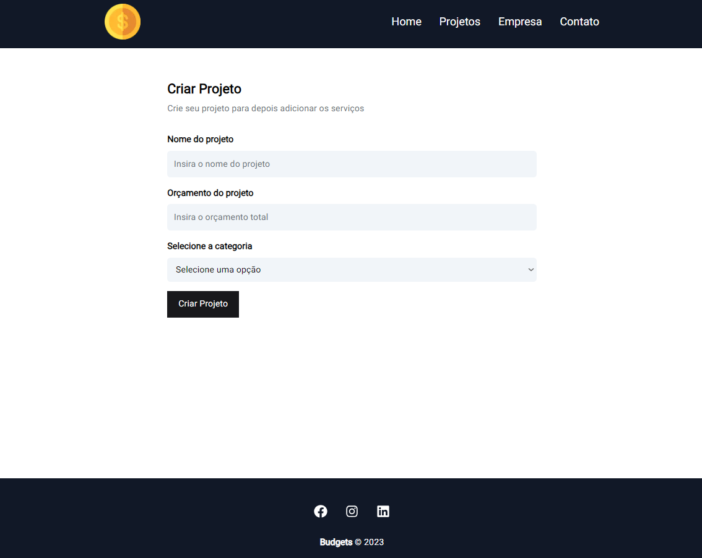
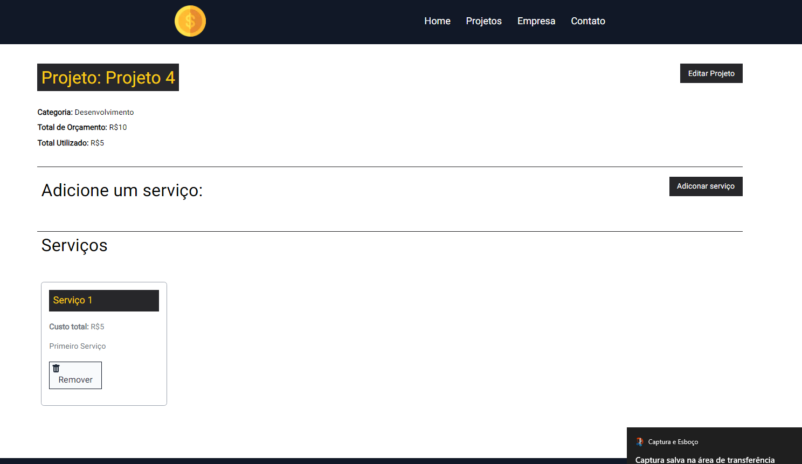

# Budgets

Um site de gerenciamento de custos e planejamentos, você pode realizar orçamentos, adicionar, editar e deletar projetos e serviços.

## Tecnologias

 - React, Next 13, TailwindCSS, TypeScript

## Funcionalidades

- Single Page Application
- CRUD (Create, read, update, delete)
- Multiplataforma

## 🔗 Links

## Screenshots

